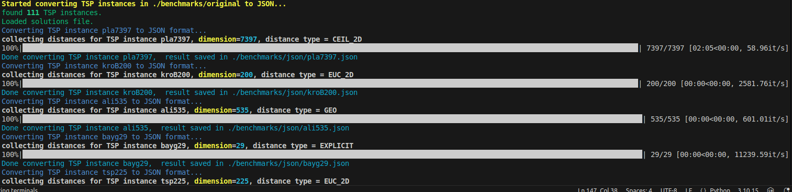

# TSPLIB JSON Converter

A Python utility to convert TSPLIB-format Symmetric Traveling Salesman Problem (TSP) instances into self-contained JSON files. This utility relies on [tsplib95](https://github.com/rhgrant10/tsplib95) to parse instance files. The upper half of the distance matrix (excluding the main diagonal), along with the cost of the best known solution, is added to the JSON file. This allows the JSON files to be used in TSP solvers written in any programming language, independently of the Python package `tsplib95`.

## Features

- Converts TSPLIB `.tsp` files to JSON format.
- Removes redundant sections to reduce JSON file size.
- Supports command-line interface via [Typer](https://typer.tiangolo.com/).
- Shows progress with [tqdm](https://github.com/tqdm/tqdm) and colored output via [Rich](https://github.com/Textualize/rich).



## Installation and Usage

Clone the repository, install dependencies via Poetry, and activate the environment:

```bash
git clone https://github.com/skanderk/tsplib-json.git
cd tsplib-json
poetry install
poetry shell
```

Run the default conversion command to convert all `.tsp` files in benchmarks/original to JSON, the results are saved under `benchmarks/json`:

```bash
typer main.py run
```

The converted JSON files include the upper half of the distance matrix (excluding the main diagonal) and the cost of the best known solution. Solutions and TSP files were pulled on November 7th, 2025 from https://github.com/mastqe/tsplib

You can also specify alternate source and output directories:

```bash
typer main.py run --src-directory some_src_dir --out-directory some_out_dir
```

Make sure to copy the solutions file from benchmarks/original to some_src_dir beforehand. Most symmetric TSP instances have already been converted to JSON and are located in benchmarks/json. However, the JSON conversion for the following instances is not included in this repository:

* **Time-consuming conversions (estimated 10 hours for pla85900)**: `pla85900`, `pla33810`, `d18512`

* **Large JSON files exceeding GitHub's 50 MB limit**: `pla7394`, `rl11849`, `d18512`, `usa13509`, `d15112`, `brd1405`

## Sample Output
```json
{
  "name":"burma14",
  "comment":"14-Staedte in Burma (Zaw Win)",
  "type":"TSP",
  "dimension":14,
  "edgeWeightType":"GEO",
  "displayDataType":"COORD_DISPLAY",
  "edgeWeightFormat":"FUNCTION",
  "nodeCoordSection":{"1":[16.47,96.1],"2":[16.47,94.44],"3":[20.09,92.54],
    "4":[22.39,93.37],"5":[25.23,97.24],"6":[22,96.05],"7":[20.47,97.02],
    "8":[17.2,96.29],"9":[16.3,97.38],"10":[14.05,98.12],"11":[16.53,97.38],
    "12":[21.52,95.59],"13":[19.41,97.13], "14":[20.09,94.55]},
  "bestKnownCost":3323,
  "distancesMatrix":[
    [153,510,706,966,581,455,70,160,372,157,567,342,398],
    [422,664,997,598,507,197,311,479,310,581,417,376],
    [289,744,390,437,491,645,880,618,374,455,211],
    [491,265,410,664,804,1070,768,259,499,310],
    [400,514,902,990,1261,947,418,635,636],
    [168,522,634,910,593,19,284,239],
    [389,482,757,439,163,124,232],
    [154,406,133,508,273,355],
    [276,43,623,358,498],
    [318,898,633,761],
    [582,315,464],
    [275,221],
    [247],
    []]
}
```

